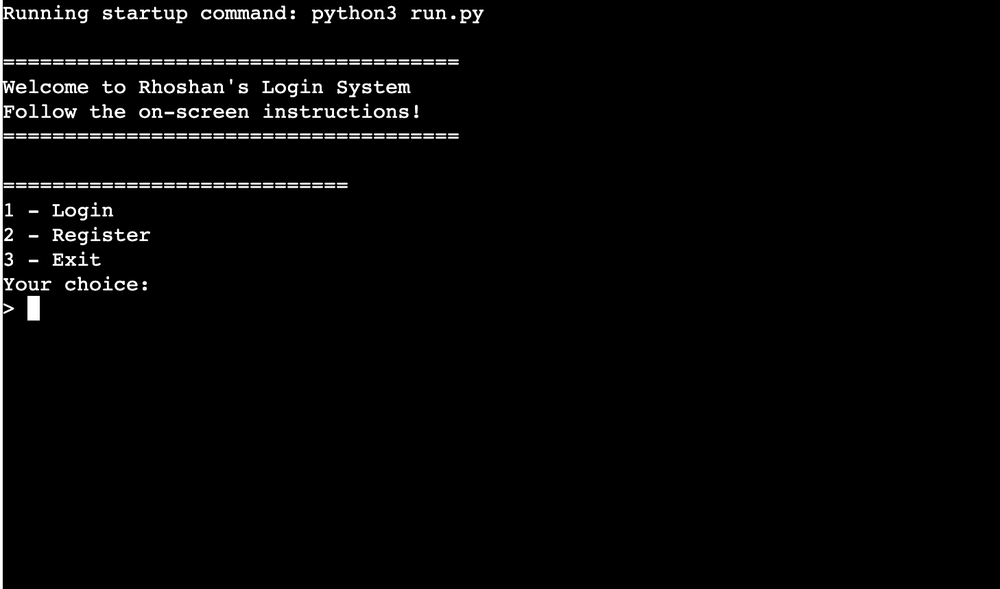
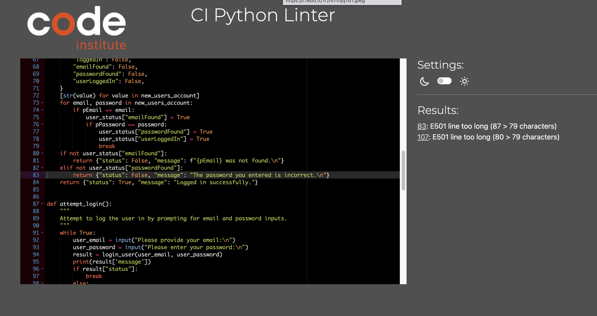

# Rhoshan's Login Management System

This is Rhoshan's Login Management System, my third project. It aims to mimic the user registration and signup processes you'd typically find on a webpage, but it's all done through a simple terminal interface for easy use. Originally, I planned to add more features like an admin interface for managing accounts, including options for deleting accounts, resetting passwords securely, and adding more authentication methods. However, I didn't get around to adding those yet. Thanks for checking it out!



## Project Goals
- *Secure User Authentication*: Ensure the user enters a valid email and password to access their account.
- *Efficient User Management*: Provide a system for adding, validating, and managing user accounts using Google Sheets.
- *User-Friendly Interface*: Develop a terminal based interface that is easy to navigate and operate.
- *Data Integrity*: Make sure user data is accurately stored and retrieved from Google Sheets.

## Setup

### Google API Credentials (`creds.json`)

To use this application, you need to set up Google API credentials (`creds.json`) for authentication with Google Sheets. Here's how you can obtain and configure these credentials:

1. **Create a Google Cloud Project**:
   - Go to the [Google Cloud Console](https://console.cloud.google.com/).
   - Create a new project or select an existing one.

2. **Enable Google Sheets API**:
   - In the Cloud Console, navigate to **APIs & Services > Dashboard**.
   - Click on **Enable APIs and Services**.
   - Search for "Google Sheets API" and enable it for your project.

3. **Create Service Account**:
   - In the Cloud Console, navigate to **IAM & Admin > Service Accounts**.
   - Click on **+ Create Service Account**.
   - Enter a name and description for the service account, then click **Create**.
   - Assign the "Editor" role (or appropriate permissions) to the service account.

4. **Generate Credentials (`creds.json`)**:
   - After creating the service account, click on **Generate Key**.
   - Select JSON as the key type and click **Create**.
   - This will download a JSON file (`creds.json`) containing your credentials. 

5. **Store `creds.json` Safely**:
   - Place the downloaded `creds.json` file in the root directory of your project.

### Installation

1. Clone the repository:

   ```bash
   git clone https://github.com/rhoshan-d/rhoshans-login-system.git
   cd rhoshans-login-system
   ```

2. Install dependencies:

   ```bash
   pip install -r requirements.txt
   ```

### Usage

- Run the application:

  ```bash
  python main.py
  ```

- Follow the on-screen prompts to either log in or register.

## Features

### Feature overview:

| Feature | Description |
| ------- | ----------- |
| Login | Authenticates User and logins upon correct credentials.
| Register | Signs in new user with a unique email and password.
| Validate Email | Ensures the email entered is in the right format and is from the right domain.
| User Authentication | Email and Password Combination validated through worksheet Users. 
| User Data Management | Stores and updates the users information into the google sheets

Below is main features in elaborated manner :
#### Validate Email
This function validates the email id that it has '@' and ends with .com or .net or .ie

#### Register User
This is the function that asks for a user's email and password, validates the email, and further checks if the email is found to be existing. If the email is valid and does not exist, this function saves the information of the new user in the Users worksheet.

## Log In User
This function gets the user's email and password, validates the email, verifies the credentials with the saved credentials from the Users worksheet, and logs in the user if the credentials match.

#### User Data Management
Helps in managing storage and retrieval of user data from the Google Sheets, and this will help put the user's information up to date and accurate.

## UX Design
The program will be run via a terminal interface to enable the best user experience in using the program. The design secures clarity in navigation and ease. User prompts and feedback will be intuitive and informative.

## User Stories

### New Site Users

* As a new user, I want to understand what the tool does.
* As a new user, I want to have a clear overview of the functionalities.

### Returning Site Users

- Being a New User, I wish to have a simple and clear interface.
- Being a Returning User, I need a reliable way to keep my used credentials.
- Being a Returning User, I should be able to login simply and quickly.

## Testing
The following actions were tested incrementally during development and after project completion, which comprised of:

- Validation checks for email and password inputs.
- Testing the log-in and sign-up logic 
 - Making it more resilient to invalid inputs and giving sufficient feedback 

### Bugs (all not fixed yet) 
None yet.. .

### Bugs (already fixed) 

| Bug | Description | Correction  | 
| --- | ----------- | ---------- | 
| Wrong email formatting | The system allowed some wrong email formats | Added validation to check for '@' and allowed domains |
| Duplicate email registration | Users could register with a previously used email. | Added a check to be able to not register using a previously used email. |

### Validator Testing
Validator testing was done using https://pep8ci.herokuapp.com/. Found no significant issues.



## Deployment
The site installed is deployed to Heroku using a GitHub repository data store.

### Configure Heroku
To configure Heroku :

1. Visit the website https://id.heroku.com/login and either log in to account or create one. 
2. Create a new app on Heroku.
3. Link the app to GitHub and then select the branch to be deployed.
4. Add necessary creds and configure the environment.

### GitHub

Setting up your repository in GitHub :

1. In your GitHub repository, go to the Settings tab.
2. Under the source section, select Main Branch from the drop-down and hit "Save".
3. Under the repository topic section, select the template topic.
4. Under the About section, write a short description of the template.
5. Clone repository locally by following the prompted instructions.

## Tools & Technologies used

- Python librariers including gspread
- Git for version control
- GitHub for storing code
- Heroku for Deploying

## Rationale for Using Specific Libraries

### gspread
- *Why I used it*: I am using gspread to work with Google Sheets because it's a simple way to store the users information in the cloud. It helps connect to Google Sheets easily and manage user data effectively. The inspiration to use gspread was from the Love Sandwiches project as it seemed like a perfect fit.

## Improvements and ideas for future projects

- Improve on validation mechanisms for improved security.
- Enhance the design of terminal interface
- Add password recovery and two factor authentication among other features.
- Create the ability to reset password.
- Add a 'forgot password' option.

## Credits

### Content
This README's structure and content were created by myself with the help and guidance of Google, Youtube and some AI (AI really helps me word things better :D).
### Code

| No | Description | Source | URL |
| -- | ----------- | ------ | --- |
| 1 | Using ASCII tables for a better view | GeeksforGeeks | https://www.geeksforgeeks.org/generate-simple-ascii-tables-using-prettytable-in-python/ |
